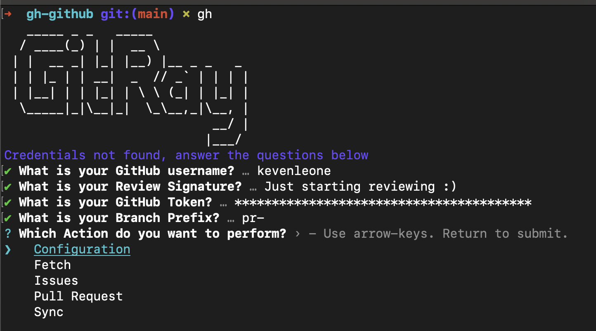
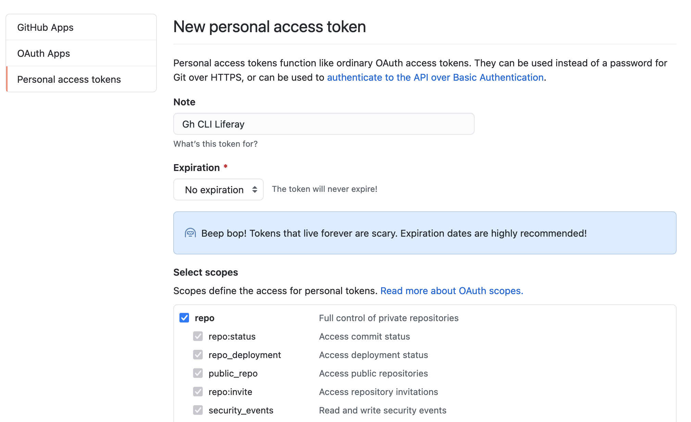
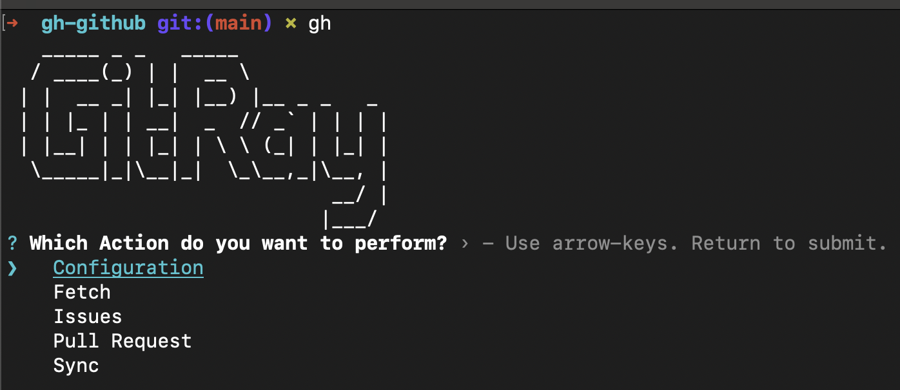

<p align="center">
  <a href="http://makeapullrequest.com">
    
  </a>
  <a href="https://opensource.org/licenses/MIT">
    
  </a>
</p>

<p align="center">
Simple CLI to help users with Github Commands using <a href="https://github.com/google/zx">google/zx</a>
</p>

## :house: Getting started

This project is a helper, to guide and help begginers with tipical activities used at Liferay, to interact with Github, such as Send, List and Get a Pull Request from some fork;

The project is **under development**  and may not be fit 100% your needs. So, if you want something more robust, I'd like to suggest using [Github CLI](https://github.com/cli/cli) or [Node-GH](https://github.com/node-gh/gh)

Actually, this project has some inspiration with Node-GH.
## :book: Requirement

Node.js >= `14.8.0`
Git >= `1.7.0`

## :zap: Install

```bash
npm i -g yarn # Skip if you already use it
npm i -g zx
yarn add-alias
```

When running `yarn add-alias` you need to configure which Bash are you using and then put your alias to call this project, I suggest using `gh` or any other of your preference.

Note: **Be careful to not asign an alias already in use in your computer**, such as *cd*, *git*, *mv*, *ga* etc. 

Before configure this part, verify if the alias you want aren't in use.

## :gear: Configuration

After everything setup, open a terminal of your preference and type with the alias used in `add-alias` step, like this;



You need to fill some fields;
* **What is your GitHub username**: Is the user you're signed in.
* **What is your GitHub Signature**: This Signature is used when you are fetching a PR from someone and a message is added there.
* **What is your GitHub Token**: You need to create a GitHub Personal Access Token for this. Follow these steps:
  * Login in your Github Account
  * Go to this page: https://github.com/settings/tokens
  * Generate new token
  * 
  * Put a fancy name, on Note Input
  * Put expiration date you want, I suggest to choose a longer expiration date, or no expiration for this.
  * On Select Scopes, check all the boxes inside **repo**
  * On the bottom, click on Generate Token
  * After generate a token, you'll be redirect to other screen, copy the generated token inside the green box, and use as GitHub Token in this CLI.
  * 
* **What is your Branch Prefix**: Whenever you fetch a PR from someone, a branch is created using this prefix and the Pull Request ID, if you are fetching the **100** from `pt-liferay-solutions/liferay-portal` a branch called **pr-100** will be created.

And after the first access configuration, this will'be the first screen


## :handshake: **Contributing**
If you liked the project and want to cooperate feel free to fork this repository and send Pull Requests.

All kinds of contributions are very welcome and appreciated

-   ⭐️ Star the project
-   🐛 Find and report issues
-   📥 Submit PRs to help solve issues or add features

## :book: License
MIT license, Copyright (c) 2021 Keven Leone.
